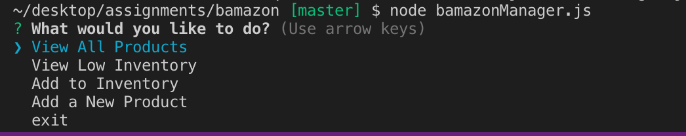
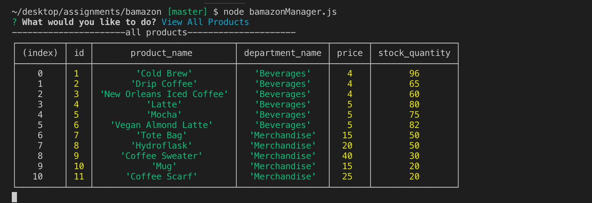
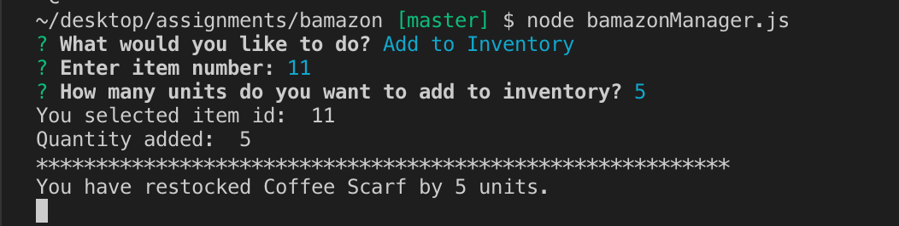

# bamazon

Bamazon is like an Amazon-like storefront created with MySQL and Node. 

bmazonCustomer.js

The app would take in orders from the user and deplete the stock from the store's inventory when the user purchases the item. 

     

A table of all the products offered will be shown to the user with id number, product name, department name, price and stock quantity. 

     

After inputting the id number, the next prompt would ask for the units.

     

Once the two prompts are answered, the selected product will be displayed by itself in one row for the user.
Also would console.log the quantity selected and which product is selected and price of the product per unit. 
Next the inventory is depleted and the updated amount of quantity in store inventory is shown.
The total price of the order is  calculated based on quantity and price.

     

Next prompt is a list that would ask the user if they want to continue with the purhcasing or exit. 
By continuing it would go back to the ordering process.

     

Instead of continuing with the purchase. The other option on the list is to exit.
Once exit is chosen. Exiting message is displayed and connection is ended. 

bamazonManager.js

The app can also run from manager's view. Will give manager's control of the inventory such as viewing whole inventory or low inventory. Control of restocking inventory as well as adding a new product to the inventory. 

     

Manager's view have different choices to select from compared to customer view. Several choices are shown as a list for the user to 
choose from. 

     

Full table of all products available in inventory.

     

Option to view low inventory. Will only show products that have a quantity of 15 or less. 

     

The add to inventory would allow the user to select a product based on the product id and would allow the user to increase quantity of the product. 