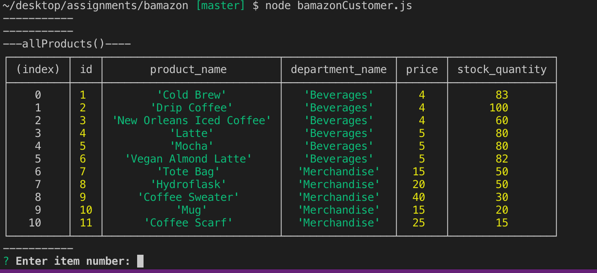
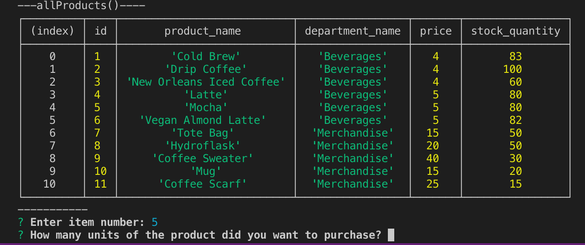
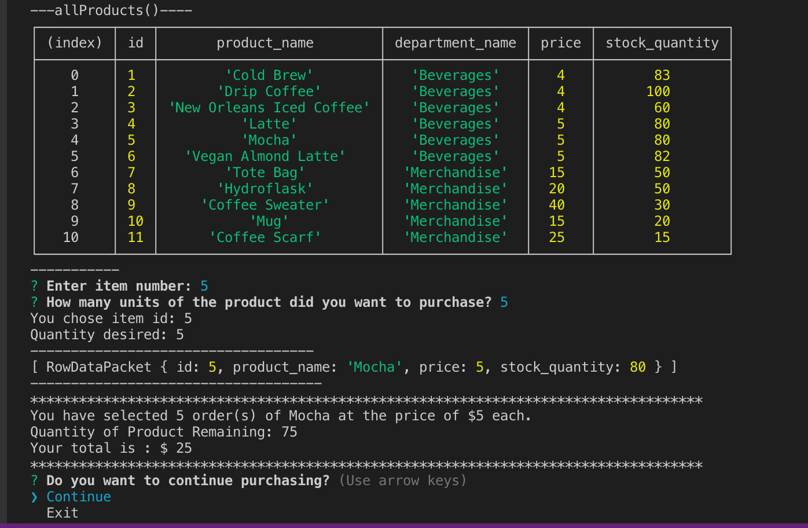
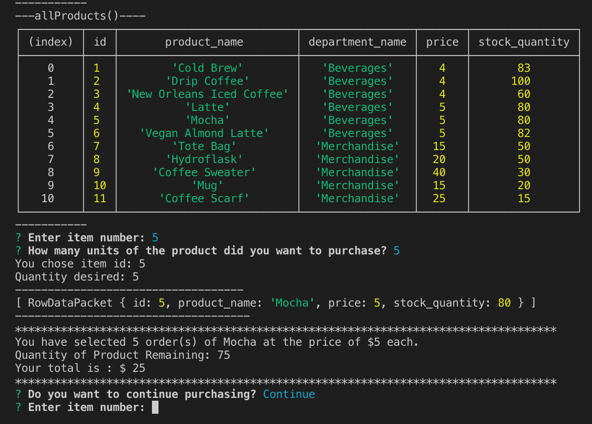
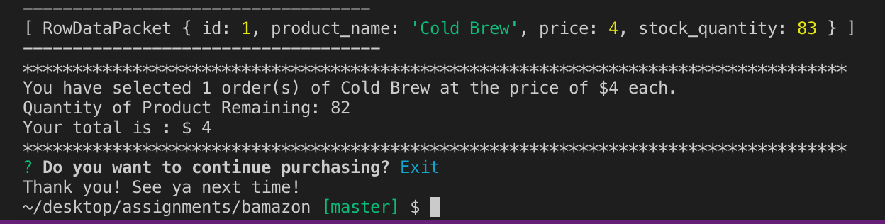

# bamazon

Bamazon is like an Amazon-like storefront created with MySQL and Node. 
The app would take in orders from the user and deplete the stock from the store's inventory when the user purchases the item. 

     

A table of all the products offered will be shown to the user with id number, product name, department name, price and stock quantity. 

     

After inputting the id number, the next prompt would ask for the units.

     

Once the two prompts are answered, the selected product will be displayed by itself in one row for the user.
Also would console.log the quantity selected and which product is selected and price of the product per unit. 
Next the inventory is depleted and the updated amount of quantity in store inventory is shown.
The total price of the order is  calculated based on quantity and price.

     

Next prompt is a list that would ask the user if they want to continue with the purhcasing or exit. 
By continuing it would go back to the ordering process.

     

Instead of continuing with the purchase. The other option on the list is to exit.
Once exit is chosen. Exiting message is displayed and connection is ended. 